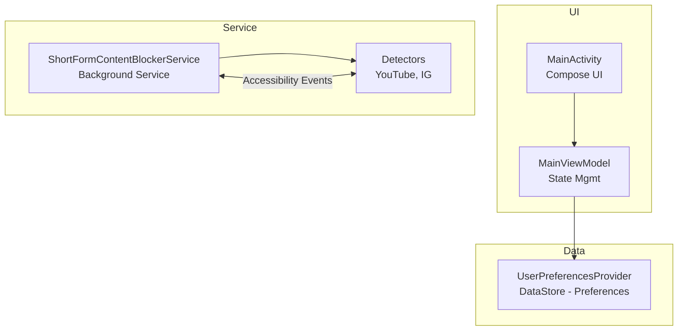

# Getting Started - Developer Guide

Quick guide to get you building and contributing to Shorts Blocker.

## Prerequisites

- **JDK 17+** - Required for Android development
- **Android Studio** - Latest stable version recommended
- **Android SDK** - API 24 (Android 7.0) minimum, API 36 target
- **Git** - For version control

## Quick Setup

### 1. Clone the Repository

```bash
git clone <repository-url>
cd Shorts-Blocker
```

### 2. Open in Android Studio

1. Launch Android Studio
2. Select "Open"
3. Navigate to the cloned directory
4. Let Gradle sync (takes a few minutes first time)

### 3. Build and Run

**Debug Build:**

```bash
./gradlew assembleDebug
```

**Run on Device/Emulator:**

```bash
./gradlew installDebug
```

Or use Android Studio's Run button (▶️).

## Project Structure

```
Shorts-Blocker/
├── app/
│   └── src/main/kotlin/dev/atick/shorts/
│       ├── services/
│       │   ├── ShortFormContentBlockerService.kt    # Main service
│       │   └── detectors/
│       │       ├── ShortFormContentDetector.kt      # Detector interface
│       │       ├── YouTubeShortsDetector.kt         # YouTube implementation
│       │       └── InstagramReelsDetector.kt        # Instagram implementation
│       ├── ui/
│       │   ├── screens/                             # Compose screens
│       │   ├── components/                          # Reusable UI components
│       │   └── viewmodels/                          # ViewModels
│       ├── utils/
│       │   ├── AccessibilityServiceManager.kt       # Service helpers
│       │   ├── UserPreferencesProvider.kt           # DataStore wrapper
│       │   └── PackageConstants.kt                  # App package configs
│       └── models/
│           └── TrackedPackage.kt                    # Data models
├── docs/                                            # Documentation
└── build.gradle.kts                                 # Root build config
```

## Key Concepts

### Accessibility Service

The core of the app. It monitors accessibility events from other apps.

**File:** `ShortFormContentBlockerService.kt`

- Listens to accessibility events
- Routes events to appropriate detector
- Performs back action when content detected
- Enforces cooldown to prevent spam

### Detectors

Platform-specific logic to identify short-form content.

**Interface:** `ShortFormContentDetector.kt`

Each detector implements:

- `isShortFormContent()` - Detection logic
- `getPackageName()` - Target app package

**Example - YouTube:**

```kotlin
class YouTubeShortsDetector : ShortFormContentDetector {
    override fun isShortFormContent(
        event: AccessibilityEvent,
        rootNode: AccessibilityNodeInfo,
        resources: Resources
    ): Boolean {
        // Check for full-screen content
        // Verify Shorts-specific UI elements
        // Return true if detected
    }
}
```

### UI Layer

Modern Jetpack Compose with Material 3.

- **MainScreen**: Service status and package toggles
- **MainViewModel**: State management
- **Components**: Reusable UI pieces

## Common Tasks

### Add a New App to Track

1. **Create Detector**

Create `NewAppDetector.kt` in `services/detectors/`:

```kotlin
class NewAppDetector : ShortFormContentDetector {
    override fun getPackageName() = "com.newapp.android"

    override fun isShortFormContent(
        event: AccessibilityEvent,
        rootNode: AccessibilityNodeInfo,
        resources: Resources
    ): Boolean {
        // Your detection logic here
        // Check UI elements, screen size, etc.
        return false
    }
}
```

2. **Register Detector**

Add to `ShortFormContentBlockerService.kt`:

```kotlin
private val detectors: Map<String, ShortFormContentDetector> by lazy {
    mapOf(
        "com.google.android.youtube" to YouTubeShortsDetector(),
        "com.instagram.android" to InstagramReelsDetector(),
        "com.newapp.android" to NewAppDetector(), // Add this
    )
}
```

3. **Add to Constants**

Update `PackageConstants.kt`:

```kotlin
const val NEWAPP_PACKAGE = "com.newapp.android"

val AVAILABLE_PACKAGES = listOf(
    // ... existing packages
    TrackedPackage(
        packageName = NEWAPP_PACKAGE,
        displayName = "New App",
        description = "Block New App short videos",
        isEnabled = false,
    ),
)
```

Done! The UI will automatically show the new app.

### Detailed Guide: Adding a New Detector

This section provides step-by-step instructions with best practices.

#### Step 1: Analyze the Target App

Before writing code, use Android Studio's Layout Inspector:

1. **Enable Developer Options** on your test device
2. **Open the target app** to the short-form content section
3. **Launch Layout Inspector**: Tools > Layout Inspector
4. **Identify unique elements**:
   - Look for distinctive view IDs (e.g., "reel_player", "shorts_container")
   - Note element hierarchy and patterns
   - Check for elements unique to short-form vs regular content

**Example findings:**
```
TikTok:
- View ID: "feed_view_pager" (present in For You feed)
- Parent: "com.ss.android.ugc.aweme:id/video_container"
- Full-screen video player in vertical layout
```

#### Step 2: Create the Detector Class

Create a new file in `services/detectors/`:

```kotlin
/*
 * Copyright 2025 Atick Faisal
 * [License header...]
 */

package dev.atick.shorts.services.detectors

import android.content.res.Resources
import android.view.accessibility.AccessibilityEvent
import android.view.accessibility.AccessibilityNodeInfo
import timber.log.Timber
import java.util.ArrayDeque

/**
 * Detector for TikTok short-form content.
 *
 * Identifies when user is watching TikTok videos by detecting the
 * distinctive feed_view_pager element in the For You feed.
 *
 * Detection Strategy:
 * - Searches for "feed_view_pager" view ID
 * - Verifies full-screen vertical layout
 * - Confirms video container is present
 *
 * Compatibility: Tested with TikTok 32.x - 34.x
 */
class TikTokDetector : ShortFormContentDetector {

    override fun getPackageName(): String = "com.zhiliaoapp.musically"

    override fun isShortFormContent(
        event: AccessibilityEvent,
        rootNode: AccessibilityNodeInfo,
        resources: Resources,
    ): Boolean {
        val queue = ArrayDeque<AccessibilityNodeInfo>()
        queue.add(rootNode)

        var nodeCount = 0
        val maxNodes = 100 // Limit traversal for performance

        while (queue.isNotEmpty() && nodeCount < maxNodes) {
            val node = queue.removeFirst()
            nodeCount++

            // Get view ID and convert to lowercase for consistency
            val viewId = node.viewIdResourceName?.lowercase()

            // Check for TikTok's feed view pager
            if (viewId != null && "feed_view_pager" in viewId) {
                Timber.i("[TikTok] Short-form content detected via feed_view_pager")
                return true
            }

            // Add children to queue for BFS traversal
            for (i in 0 until node.childCount) {
                node.getChild(i)?.let(queue::add)
            }
        }

        Timber.v("[TikTok] No short-form content detected ($nodeCount nodes scanned)")
        return false
    }
}
```

#### Step 3: Register the Detector

Update `ShortFormContentBlockerService.kt`:

```kotlin
private val detectors: Map<String, ShortFormContentDetector> by lazy {
    mapOf(
        "com.google.android.youtube" to YouTubeShortsDetector(),
        "com.instagram.android" to InstagramReelsDetector(),
        "com.zhiliaoapp.musically" to TikTokDetector(), // ← Add this
    )
}
```

#### Step 4: Add to Package Constants

Update `utils/PackageConstants.kt`:

```kotlin
object PackageConstants {
    const val YOUTUBE_PACKAGE = "com.google.android.youtube"
    const val INSTAGRAM_PACKAGE = "com.instagram.android"
    const val TIKTOK_PACKAGE = "com.zhiliaoapp.musically" // ← Add this

    val AVAILABLE_PACKAGES = listOf(
        TrackedPackage(
            packageName = YOUTUBE_PACKAGE,
            displayName = "YouTube",
            description = "Block YouTube Shorts",
            isEnabled = true,
        ),
        TrackedPackage(
            packageName = INSTAGRAM_PACKAGE,
            displayName = "Instagram",
            description = "Block Instagram Reels",
            isEnabled = false,
        ),
        TrackedPackage(
            packageName = TIKTOK_PACKAGE,
            displayName = "TikTok",
            description = "Block TikTok videos",
            isEnabled = false,
        ),
    )

    val DEFAULT_ENABLED_PACKAGES = AVAILABLE_PACKAGES
        .filter { it.isEnabled }
        .map { it.packageName }
}
```

#### Step 5: Test Your Detector

1. **Build and install**:
   ```bash
   ./gradlew installDebug
   ```

2. **Enable accessibility service** in Settings

3. **Enable your new app** in the Shorts Blocker UI

4. **Monitor logs**:
   ```bash
   adb logcat | grep -E "TikTok|ShortForm"
   ```

5. **Open target app** and navigate to short-form content

6. **Verify detection**: Look for log messages indicating detection

**Expected logs:**
```
I/ShortFormContentBlockerService: [com.zhiliaoapp.musically] Short-form content detected!
I/TikTokDetector: [TikTok] Short-form content detected via feed_view_pager
D/ShortFormContentBlockerService: [com.zhiliaoapp.musically] BACK action performed successfully
```

#### Step 6: Handle Edge Cases

Consider these scenarios:

- **False positives**: Detector triggers on regular content
  - Solution: Add additional checks to narrow detection
  
- **Missed detections**: Some content not caught
  - Solution: Look for alternative UI elements
  
- **App updates**: Detection breaks after app update
  - Solution: Test with latest app version, update view IDs

**Example refinement:**
```kotlin
override fun isShortFormContent(...): Boolean {
    // ... existing code ...
    
    // Additional check to reduce false positives
    if (viewId != null && "feed_view_pager" in viewId) {
        // Verify it's actually playing video, not paused
        val isPlaying = checkVideoPlayingState(node)
        if (isPlaying) {
            Timber.i("[TikTok] Confirmed short-form content")
            return true
        }
    }
    // ...
}
```

#### Detection Best Practices

✅ **DO:**
- Limit node traversal (50-150 nodes max)
- Use BFS (breadth-first search) with ArrayDeque
- Convert view IDs to lowercase for comparison
- Add descriptive Timber logs
- Test on multiple app versions
- Document detection strategy in KDoc
- Handle null safety

❌ **DON'T:**
- Use DFS (can be very deep, slow)
- Check unlimited nodes (performance)
- Use hardcoded strings without explanation
- Forget to recycle nodes if manually creating them
- Rely on text content (can change with language)

### Test Detection Logic

Enable verbose logging and use Logcat:

```bash
adb logcat | grep -E "(Shorts-Blocker|ShortForm|Detector)"
```

Look for:

- Event types received
- UI elements detected
- Detection results

### Debug Accessibility Service

**Check if service is running:**

```bash
adb shell settings get secure enabled_accessibility_services
```

**Force restart service:**

1. Disable in accessibility settings
2. Re-enable
3. Check logs

## Building for Release

### 1. Create Keystore

```bash
keytool -genkey -v -keystore key.jks -keyalg RSA -keysize 2048 -validity 10000 -alias shorts-blocker
```

### 2. Create keystore.properties

```properties
storeFile=key.jks
storePassword=your_store_password
keyAlias=shorts-blocker
keyPassword=your_key_password
```

### 3. Build Release APK

```bash
./gradlew assembleRelease
```

APK will be in: `app/build/outputs/apk/release/`

## Development Tips

### Hot Reload Isn't Enough

Accessibility services don't hot reload. After code changes:

1. Build and install
2. Disable service in settings
3. Re-enable service
4. Test

### Use Layout Inspector

Android Studio > Tools > Layout Inspector

Helps identify:

- View IDs to target
- UI hierarchy
- Element properties

### Timber Logging

The app uses Timber for logging (debug builds only):

```kotlin
Timber.d("Debug message")
Timber.i("Info message")
Timber.w("Warning")
Timber.e("Error message")
```

### Test on Real Device

Emulators don't have the target apps. Test on:

- Real device with YouTube/Instagram installed
- Different Android versions
- Different screen sizes

## Architecture Overview



## Contributing Guidelines

1. **Keep it simple** - No unnecessary complexity
2. **Test thoroughly** - Especially detector logic
3. **Document changes** - Update KDocs
4. **One feature per PR** - Small, focused changes
5. **Follow conventions** - Match existing code style

## Testing Checklist

Before submitting PR:

- [ ] Debug build compiles
- [ ] Release build compiles
- [ ] Accessibility service starts correctly
- [ ] Detection works on test device
- [ ] UI updates properly
- [ ] No crashes in logs
- [ ] KDocs updated
- [ ] No new lint warnings

## Troubleshooting

**Gradle sync fails:**

- Check JDK version (need 17+)
- Invalidate caches: File > Invalidate Caches > Invalidate and Restart

**Service not detecting:**

- Check service is enabled in settings
- Verify package name is correct
- Check Logcat for errors
- Try disable/enable service

**Build succeeds but app crashes:**

- Check ProGuard rules if release build
- Look for ClassNotFoundException in logs
- Verify all resources are included

**Can't install APK:**

```bash
adb uninstall dev.atick.shorts
adb install app/build/outputs/apk/debug/app-debug.apk
```

## Useful Commands

```bash
# Clean build
./gradlew clean

# List all tasks
./gradlew tasks

# Build both debug and release
./gradlew build

# Install and run debug
./gradlew installDebug && adb shell am start -n dev.atick.shorts/.MainActivity

# View logs
adb logcat | grep Shorts-Blocker

# Check APK size
ls -lh app/build/outputs/apk/release/*.apk
```

## Resources

- [Android Accessibility](https://developer.android.com/guide/topics/ui/accessibility/service)
- [Jetpack Compose](https://developer.android.com/jetpack/compose)
- [Material 3 Design](https://m3.material.io/)
- [DataStore](https://developer.android.com/topic/libraries/architecture/datastore)

## Need Help?

- Check existing issues
- Review detector implementations
- Test on different devices
- Open an issue with logs and device info

---

**Ready to code?** Open the project in Android Studio and start exploring! 🚀
